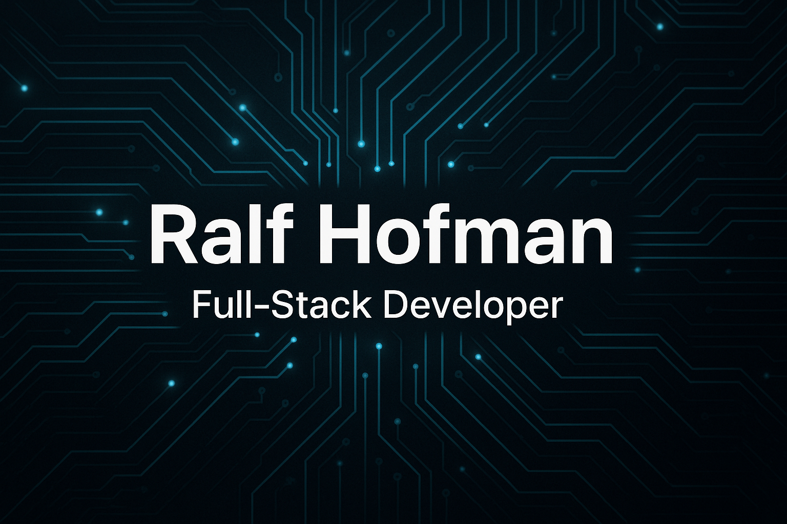

  

# Ralf Hofman — Full-Stack Developer

  
  
  
  
  

I build web apps, automations, and tools I use every day.  
Everything runs on my own infrastructure: **homeserver, NAS, VPS, self-hosted stack, Tailscale mesh**.  
From family role-based apps to media ecosystems — I build and maintain it myself.

---

## 🌐 Portfolio
https://byralf.com

---

## 📬 Info
**Mail:** info@byralf.com  
**Portfolio:** https://byralf.com  
**Focus:** full-stack · infrastructure · selfhosting  
**Style:** direct, efficient, no bullshit
